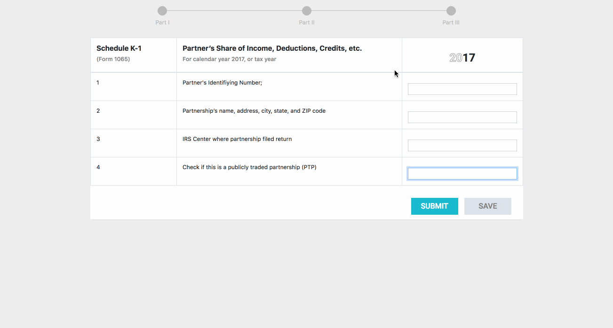

# Development Test: Creating a 2017 Tax Form
Erin Rizal  
Front-end developer 
www.lrizal.com
## Tools Used
React, Webpack, Yarn Build, Material UI, Bootstrap, Custom CSS, Babel
## Changes from Mock-up
Since the first part of the form was not already sketched, I decided to add the first steps in, while sticking to the desired design formatting. 
## Process
I initially started with setting up the application through Webpack. From there, I instantly noticed how close the UI in the Zeplin mock-up was close to Material UI.com's library.
With some CSS gathered from the wireframe, I decided to format the logic based on the indications in color- so for example, in the top status of the form, I thought it would be most
intuitive to use ReactRouter to display each step. Upon reviewing the real form in the prompt, I also made the decision to make the initial step in a similar format to the ones already designed. For simplicity and time constraints, I also decided to have a flat-UI approach.
## Demo

## Areas of improvement
Due to the 2-hour time limit, I made short cuts with CSS libraries. This was an issue when styling components, so I would implement styling components individually, or using CSS modules. In addition, creating the top navigation bar proved to be a challenge since it required a mix of animation and interactivity that I have not created on my own before or seen in available style libraries for React. Although I like the flat appearance, I would reiterate to preserve the highlighted colors relating to the slide the user is on. It would make more sense in turns of informing the user where they are in the process.
  

If more time allowed, I would also incorporate the back end (webpack, storing data with MySQL, etc.). Even in the prototype-phase, I think that having even "dummy data" could serve as a purpose in letting user testers understand how the form interacts with the information they feed it. 
